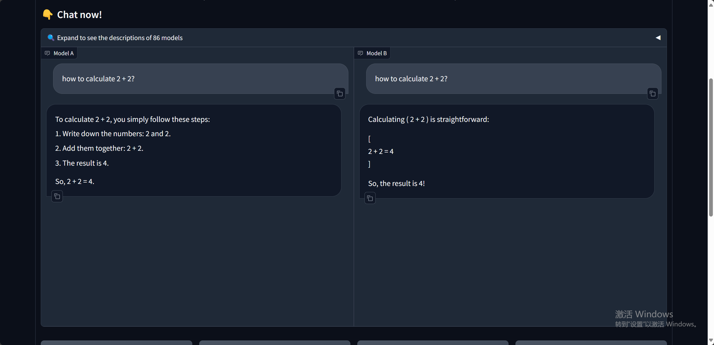
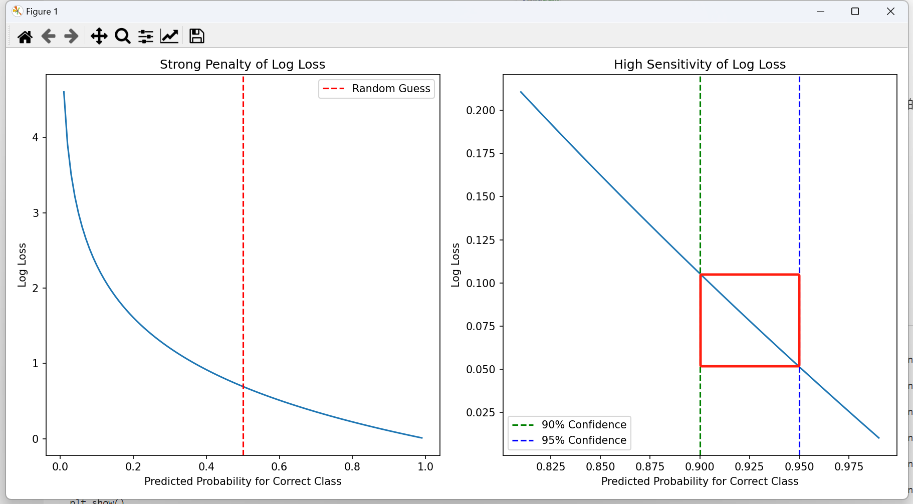
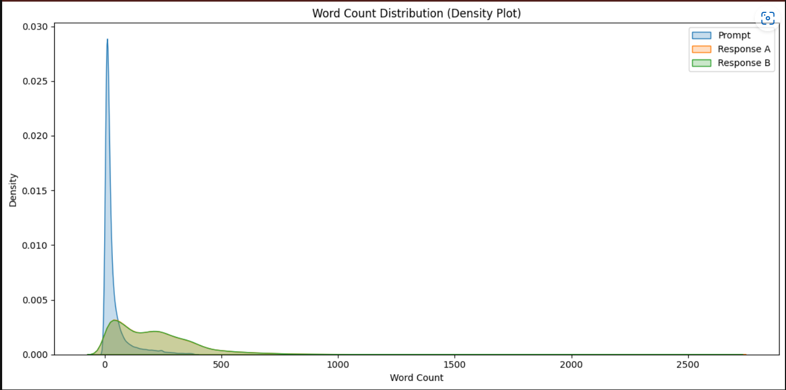
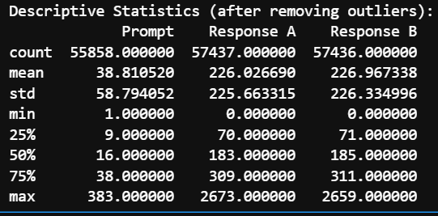
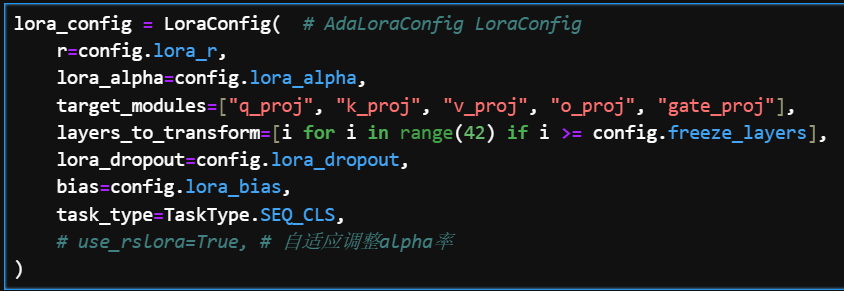
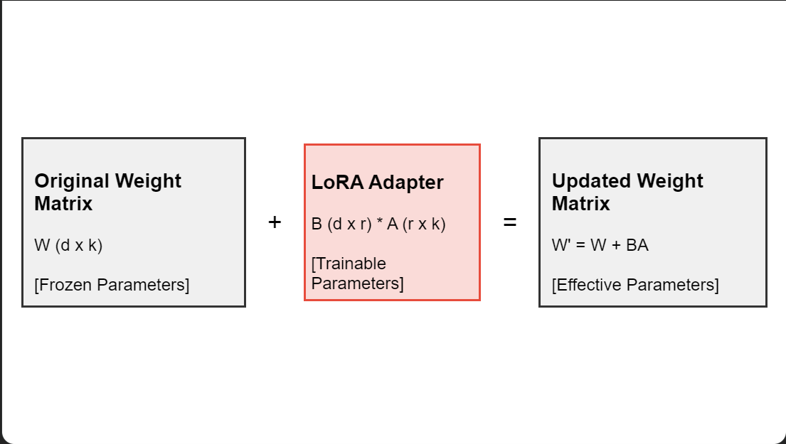
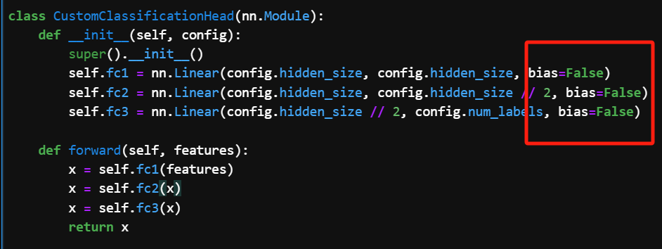

# Kaggle: LMSYS-Chatbot Arena Human Preference Predictions

**竞赛时长**: 2024年5月 - 2024年8月  
**角色**: 团队主力成员  
**链接**: [比赛介绍](https://www.kaggle.com/competitions/lmsys-chatbot-arena) | [排行榜](https://www.kaggle.com/competitions/lmsys-chatbot-arena/leaderboard)  

---

> 在本次竞赛中，我们团队表现出色，最终取得了 **0.98739** 的分数，荣获银牌（前 **2%**）。

## 概述

### 研究背景

本次竞赛的挑战是预测用户在两个人工智能对话系统（大型语言模型，LLMs）之间的对决中更偏爱哪个回答。参赛者将获得一组来自 Chatbot Arena 的对话数据，这些对话由不同的 LLM 生成。目标是开发一个优秀的机器学习模型，以改进聊天机器人与人类互动的方式，使其更符合人类的偏好。

## 数据集描述

比赛数据集由 ChatBot Arena 的用户交互组成。在每次用户交互中，评判员向两个不同的大型语言模型提供一个或多个提示，然后指出哪个模型给出了更令人满意的回应。比赛的目标是预测评判员的偏好，并确定给定的提示/回应对被选为获胜者的可能性。

[ChatBot Arena 网址](https://arena.lmsys.org/)



**注意**：这是一个代码竞赛。当您的提交被评分时，这个示例测试数据将被完整的测试集替换。训练数据中有 55K 行，测试集中预计有大约 25,000 行。

### 文件说明

- **train.csv**:
  - `id` - 行的唯一标识符。
  - `model_[a/b]` - model_[a/b] 的身份。包含在 train.csv 中但不在 test.csv 中。
  - `prompt` - 作为输入给出的提示（给两个模型）。
  - `response_[a/b]` - model_[a/b] 对给定提示的回应。
  - `winner_model_[a/b/tie]` - 标记评判选择的二进制列。真实目标列。

- **test.csv**:
  - `id`
  - `prompt`
  - `response_[a/b]`

- **sample_submission.csv**:
  - 一个正确格式的提交文件。
  - `id`
  - `winner_model_[a/b/tie]` - 这是从测试集预测的内容。

**注意**：此竞赛的数据集包含可能被认为是亵渎、粗俗或冒犯的文本。

## 任务描述

参赛者需要基于 `train.csv` 数据集进行模型训练，并对未公开的 `test.csv` 数据集进行预测。预测目标包含三个类别：

- `winner_model_a`: 模型 A 的回答更符合人类偏好
- `winner_model_b`: 模型 B 的回答更符合人类偏好
- `winner_tie`: 两个模型的回答同等优秀或同等不佳

预测结果应为每个类别的概率，且三个概率之和必须等于 1。

## 评估指标

本竞赛采用 **对数损失（Log Loss）** 作为评估指标。它适用于需要输出概率的多类别分类任务，衡量预测概率分布与真实标签分布之间的差异。

### Log Loss 计算公式

对于单个样本：

$$\text{LogLoss} = -\sum(y_i \cdot \log(p_i))$$

其中：

- $$y_i$$ 是真实标签的 one-hot 编码
- $$p_i$$ 是预测的概率

### Log Loss 特点

- **惩罚性强**：错误预测会受到严厉惩罚，尤其是高置信度的错误预测。
  
  数学描述：

  - 对于正确预测（y = 1 时 p → 1，或 y = 0 时 p → 0）：
    - $$\lim_{p \to 1} -\log(p) = 0$$
    - $$\lim_{p \to 0} -\log(1-p) = 0$$

  - 对于错误预测（y = 1 时 p → 0，或 y = 0 时 p → 1）：
    - $$\lim_{p \to 0} -\log(p) = +\infty$$
    - $$\lim_{p \to 1} -\log(1-p) = +\infty$$

  

**结论**：对于高置信度错误预测的惩罚远大于对高置信度正确预测的奖励。

## 数据处理与对话数据表示

原数据格式中的 `prompt`、`response_a` 和 `response_b` 分别是：

- `prompt`: ["prompt_1", "prompt_2", …]
- `response_a`: ["response_a_1", "response_a_2", …]
- `response_b`: ["response_b_1", "response_b_2", …]

我们需要将其解析为 JSON 格式，并将其中的字符串部分提取出来，拼接成需要的格式：

| 数据字段   | 原数据格式                                                   | 拼接后格式                                               |
| ---------- | ------------------------------------------------------------ | -------------------------------------------------------- |
| prompt     | ["你好，请问今天天气如何？", "谢谢，那明天呢？"]             | "你好，请问今天天气如何？谢谢，那明天呢？"               |
| response_a | ["今天天气晴朗，气温适宜。", "根据预报，明天多云，有小雨。"] | "今天天气晴朗，气温适宜。根据预报，明天多云，有小雨。"   |
| response_b | ["今日阳光明媚，温度宜人。", "预计明天阴天，可能有零星小雨。"] | "今日阳光明媚，温度宜人。预计明天阴天，可能有零星小雨。" |

更理想的表示方式是：

```
round_1: 
<prompt>: 你好，请问今天天气如何？
<response_a>: 今天天气晴朗，气温适宜。
<response_b>: 今日阳光明媚，温度宜人。

round_2:
<prompt>: 谢谢，那明天呢？
<response_a>: 根据预报，明天多云，有小雨。
<response_b>: 预计明天阴天，可能有零星小雨。
```

这种表示方式的优点是**保持了对话的时序性，有助于理解上下文关系**。

## 数据探索性分析（EDA）

### Tokens 数量分析

基于对话数据的 tokens 数量分布，选择 `3072` 作为最大序列长度。选择这个数字的原因是它是 16 的倍数，优化了 GPU 上的批量计算。如果不提前设定为 16 的倍数，GPU 运行时需要动态处理每一个数据的填充，这可能导致超时问题。



另外，`response_a` 和 `response_b` 的长度分布几乎一致。



## 模型选择和微调策略

### 模型选择

最终选择了 `Gemma-2-9b-it` 模型。因为在 Gemma-2 的后训练（post-training）阶段，使用了主办方的 ChatBot-1M 数据集，这意味着模型在特定领域任务中已经具备了较好的适应能力。实验也表明其表现显著优于其他模型。

### LLM 的两阶段训练

1. **预训练阶段 (Pre-training)**

- **目标**: 学习语言的基本结构、语法规则和广泛的知识。
- **数据**: 使用大量的无标注文本数据（如网页、书籍、文章等）。
- **方法**: 自监督学习（如掩码语言模型（MLM）或因果语言模型（CLM））。
- **特点**: 计算密集型，通常需要大量的 GPU 资源和时间（如在5000张 H100 集群上训练超过 1 个月）。

2. **微调阶段 (Fine-tuning)**

- **目标**: 让模型适应特定的任务或领域。
- **数据**: 使用与目标任务相关的标注数据集。
- **方法**: 有监督学习，根据特定任务的输入输出对来调整参数。
- **特点**: 可以显著提高模型在特定任务上的表现，但可能导致模型在其他任务上的性能下降（灾难性遗忘）。

在 Gemma-2 的案例中，后训练（Post-training）可以看作是预训练和微调之间的一个中间步骤，使用了更专业或特定领域的大规模数据集，训练方式接近预训练，旨在增强模型满足人类偏好的能力。



### 微调方法选择 - QLoRA

**QLoRA** 是一种高效的模型微调技术，它结合了量化（Quantization）和低秩适应（LoRA）方法。这种方法允许在有限的计算资源下微调大型语言模型，同时保持接近全参数微调的性能。

- **量化**: 使用 4 位量化来压缩主模型参数，减少内存占用。
- **低秩适应（LoRA）**: 仅训练低秩适应矩阵 `adapter`，降低了训练的计算复杂度。



#### 数学原理

QLoRA 的核心原理包括：

1. **量化**：将 32 位浮点参数压缩为 4 位整数，大幅减少内存使用。
   
   数学表示：$Q(x) = \text{round}(x / \text{scale}) \times \text{scale}$

2. **低秩适应（LoRA）**：对于权重矩阵 W，LoRA 添加一个低秩更新：
   
   $$W' = W + BA$$

   其中 $$B\in \mathbb{R}^{d \times r}$$，$$A \in \mathbb{R}^{r \times k}$$，$$r$$ 是秩（通常远小于 $$d$$ 和 $$k$$）。

3. **反向传播**：在训练过程中，梯度仅通过 LoRA 参数（A 和 B）传播，原始模型参数保持冻结。

#### 关键参数和影响

1. **量化位数**：影响模型精度。
2. **LoRA 秩（r）**：较大的 r 提供更多适应能力，但增加参数量。
3. **alpha**：影响训练稳定性和收敛速度，作用等同于学习率。
4. **适应层选择**：决定哪些层应用 LoRA，影响模型适应能力。

### 初始化 LoRA 参数：PISSA

**PISSA（Parameter-Efficient Initialization for Sequentially Stacked Adaptation）** 是一种接近全参数微调性能的初始化方法：

- **原理**：利用预训练模型的参数分布来初始化 LoRA 权重。
- **方法**：
  - 对预训练权重进行 SVD 分解。
  - 使用分解得到的矩阵初始化 LoRA 的 A 和 B。

  ```python
  U, S, Vh = torch.svd(weight)
  lora_A = U[:, :rank] * torch.sqrt(S[:rank])
  lora_B = torch.sqrt(S[:rank]).unsqueeze(0) * Vh[:rank, :]
  ```

- **优势**：提供更好的起始点，加速收敛，改善最终性能，尤其在数据量少的场景下效果更佳。

## 训练和迭代过程

在本次竞赛中，我们经历了五轮迭代，不断优化模型的性能和训练策略。以下是每一轮迭代的详细解读：

### 1. 利用额外数据集

本次比赛提供了两个额外的数据集：一个是 157k 由 GPT-4 打分的合成数据集，另一个是主办方在 2023 年发布的 33k 对话数据集。通常，额外数据集可能存在分布偏移（distribution shift），即数据分布与训练集的特征分布不同。为此，我们采用了以下策略：

- **混合训练策略**：我们采取了直接将 33k 数据集与比赛数据混合进行训练的策略，而非在额外数据集上进行第一阶段的训练，再在比赛数据上进行第二阶段的训练。这种方法基于对数据分布的深刻理解，旨在最大限度地利用所有可用的数据。

- **分布一致性验证**：为了验证新数据集是否存在分布偏移，我们使用在比赛数据上训练好的模型对额外数据集进行预测，计算其指标与比赛训练数据的接近程度。通过这种方法，我们发现 157k 数据集（由 GPT-4 标注）与人类标注之间存在显著的分布偏移。尽管 GPT-4 的评分与人类的一致性达到 84%，甚至超越人类之间的一致性，但这种一致性主要体现在专业评估 LLM 性能的指标上（如常识或代码问题），而在真实用户提问上，LLM 和人类的评估标准存在较大差异。

- **交叉验证**：为了进一步确保数据集的一致性，我们使用交叉验证来验证 33k 数据集和比赛数据的分布。首先，我们使用比赛数据训练模型并在 33k 数据集上评估；接着，我们使用 33k 数据集训练模型并在比赛数据上评估。两次实验的结果均表现出高度一致性，表明两者数据集的分布几乎一致，这种情况在实际应用中极为罕见。

$$D_1 \sim \text{比赛数据}, \quad D_2 \sim \text{33k 数据集}$$

设有分类器 $$f$$，交叉验证的验证指标 $$M$$ 满足：

$$M(f_{D_1}, D_2) \approx M(f_{D_2}, D_1)$$

基于此结果，我们决定直接将两者数据集进行混合，进一步训练模型。

**结果**：该策略使得我们的单模型在排行榜上的得分达到了 0.922，排名约为第 70 名。

### 1.1 保持标签比例一致性

在训练过程中，保持标签的比例一致性是防止模型对某些标签产生偏见的关键。例如，若训练数据中标签的顺序是 `000000000, 11111111, 22222222`，模型可能会产生错误的预测偏好。为了解决这一问题，我们采用了平衡采样（balanced sampling）的方法，使得任何一个长度为 $$ L $$ 的数据子集内的类别比例与整个数据集的类别比例一致。

假设训练集为 $$D = \{(x_i, y_i)\}_{i=1}^N$$，其中 $$y_i \in \{0, 1, 2\}$$ 为类别标签。我们希望对于任意长度为 $$L$$ 的连续子序列 $$S_L \subseteq D$$，

$$P(y = k \mid x \in S_L) \approx P(y = k \mid x \in D), \quad \forall k \in \{0, 1, 2\}$$

实现方法如下：

```python
from torch.utils.data import DataLoader, WeightedRandomSampler
import numpy as np

def create_balanced_sampler(dataset):
    class_counts = np.bincount(dataset.targets)
    class_weights = 1. / class_counts
    weights = class_weights[dataset.targets]
    sampler = WeightedRandomSampler(weights, len(weights))
    return sampler

# 使用
train_sampler = create_balanced_sampler(train_dataset)
train_loader = DataLoader(train_dataset, batch_size=32, sampler=train_sampler)
```

### 2. 测试时增强 (TTA)

为了进一步提高模型的泛化能力和鲁棒性，我们实施了测试时增强（Test Time Augmentation, TTA）策略。根据相关研究，所有的大型语言模型（LLM），包括 GPT-4，在评估过程中都表现出偏好先出现的第一个响应（response）的倾向。这种偏好会导致天然的类别预测不平衡。为了减轻这一问题，我们在推理时交换 `response_a` 和 `response_b` 的顺序，分别进行推理并取平均结果：

$$\hat{y} = \frac{1}{2} (f(x, \text{response}_a, \text{response}_b) + f(x, \text{response}_b, \text{response}_a))$$

**结果**：应用 TTA 策略后，模型的得分提升至 0.912，排名提升至第 50 名左右。

### 3. 设置最大 Tokens 为 3072

在模型训练过程中，通常的最大 tokens 设置不会超过 1536，因为随着 tokens 数量的增加，计算时间和显存需求呈指数增长。然而，通过与其他团队合作研究（沙特大学团队的 8 卡 H100 GPU 消融实验），我们得出结论：将最大 tokens 设置为 3072 是最优的参数设置。

该实验表明，在模型的最大 token 长度为 3072 时，性能得到了显著提升：

$$\text{Max Tokens} = 3072$$

**结果**：将最大 tokens 设置为 3072 后，模型得分进一步提高至 0.903，进入排行榜前 30 名。

### 4. LoRA Rank 设置为 64

为了使 QLoRA 微调的效果接近全参数微调，我们在 4 卡 A800 上使用 DeepSpeed 分布式训练框架进行了多次消融实验。实验结果表明，当 LoRA Rank 超过 64 后，性能几乎停止提升，同时训练时间和计算成本显著增加。因此，我们选择 Rank 64 作为最优参数，这不仅提高了模型性能，还保证了计算资源的可行性：

$$\text{LoRA Rank} = 64$$

**结果**：将 LoRA Rank 设置为 64 后，模型得分达到了 0.896，排名提升至第 21 名。

### 5. 替换 Score 层为三层线性层

为了进一步提升模型的分类性能，我们将 Score 层从单层线性层替换为三层线性层。此更改的核心理念在于：

1. **任务匹配的调整**：原始模型的最后一层设计用于“预测下一个 token”，这与我们需要的“分类任务”并不完全匹配。通过增加层数，我们调整了模型的任务适应性，使其更符合分类任务的需求。
   
2. **优化路径的改善**：尽管数学上单层和三层线性层在理论上是等价的，但在实际应用中，由于数据量和计算资源的限制，三层结构提供了更丰富的特征表达能力和更鲁棒的梯度表示。这优化了反向传播的路径，提高了模型的收敛性和泛化能力。

设有模型 $$g(x)$$ 和分类器 $$h(y)$$，新的 Score 层 $$h$$ 的形式为：

$$h(y) = W_3 \sigma(W_2 \sigma(W_1 y + b_1) + b_2) + b_3$$

其中 $$W_i$$ 为权重矩阵，$$b_i$$ 为偏置项，$$\sigma$$ 为激活函数。

**结果**：替换 Score 层后，模型表现更稳定，性能进一步提升。

通过以上五轮迭代，我们在训练和调优过程中成功地提高了模型的性能和鲁棒性，为竞赛取得优异成绩奠定了坚实基础。

## 未成功的方法

- **LESS 数据筛选方法**：导致模型过拟合，产生过高的置信度预测。
- **EMO 损失**：在 SFT 中有效缓解置信度过高问题，但无法解决 token 概率分布约束问题。
- **NEFTune**：在数据去重清洗后对模型无显著影响。
- **标签平滑（Label Smoothing）**：对小模型有效，但在大型模型中表现不佳。

## 额外细节

1. **SFT LoRA 微调**：只需微调 `q`、`k`、`v` 模块。  
2. **分类任务微调**：还需微调 `o` 和 `gate` 模块，以提高分类能力。  
3. **数据格式兼容性**：LoRA 可以适应不同的数据格式，快速适应新任务。  
4. **加速注意力计算**：使用 Flash Attention，加速计算，无性能损失。  
5. **神经网络的 Bias 参数**：一般情况下，设置 bias 参数为 False 更好，以避免过拟合的风险。  



## 可优化点

1. **更多数据**: 对 1M 数据打伪标签并训练，进一步提高模型的泛化能力。
2. **EMA（指数移动平均）**: 在单个模型内集成多个模型权重，进一步提高模型性能。
3. **Rdrop**: 利用对比学习降低 dropout 的影响，增强模型鲁棒性。
4. **使用 8 位量化**: 提高推理速度，支持更长的序列长度。
5. **增加两个预测头**: 预测 response_a 和 response_b 的模型来源，为模型提供更多上下文信息。

## 总结

- **多模型测试与选择**：通过初期测试发现大模型更适合任务，最终选择了 Gemma-2-9b-it 模型。
- **创新性微调方法**：使用 QLoRA 进行高效微调，平衡计算成本与性能。
- **数据增强与预处理策略**：利用额外数据集和测试时增强（TTA）技术，确保模型的鲁棒性和准确性。
- **优化与实验迭代**：多轮实验迭代，优化了 token 长度、LoRA Rank 和模型结构。
- **未来优化方向**：在数据扩展、模型集成和推理效率上还有进一步提升空间。
